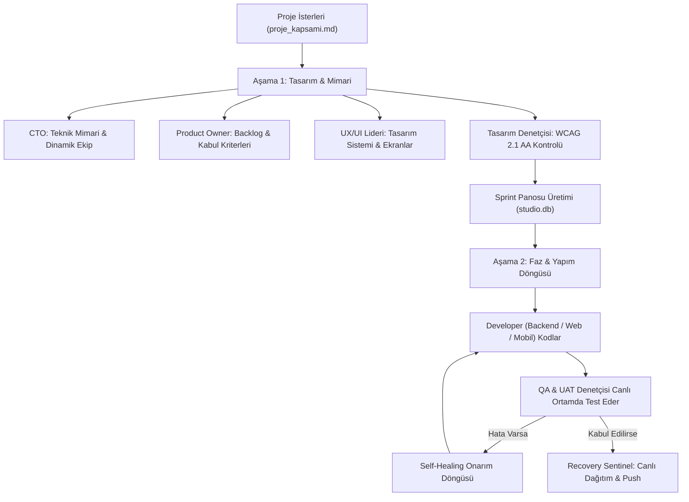

# 🤖 Digital Software Studio (Dijital Yazılım Stüdyosu)

> **Otonom Çok Ajanlı Yapay Zeka Yazılım Mühendisliği ve Üretim Stüdyosu**  
> *Autonomous Multi-Agent AI Software Engineering & Production Framework*

[](https://opensource.org/licenses/MIT)
[](https://python.org)
[](#)

Digital Software Studio, tek bir proje ister dokümanından (`proje_kapsami.md`) yola çıkarak; **CTO, Ürün Sahibi, UX/UI Tasarımcıları, Backend & Web & Mobil Geliştiricileri, QA Testçileri, UAT Denetçileri, DevOps ve Kurtarma Nöbetçisi** olmak üzere 15 farklı uzman yapay zeka ajanını organize eden, yazılımı uçtan uca mimarilendiren, kodlayan, canlı test eden ve yayına alan **tam otonom bir sanal yazılım şirketidir.**

---

## 🚀 2 Dakikada Hızlı Başlangıç (Quickstart)

Projeyi klonlayıp kendi yazılımınızı geliştirmeye başlamak için sadece 3 adım yeterlidir:

```bash
# 1. Depoyu klonlayın
git clone https://github.com/cihan53/digital-software-studio.git
cd digital-software-studio

# 2. Kurulum sihirbazını çalıştırın (venv ve önkoşulları hazırlar)
./setup.sh

# 3. Kendi proje fikrinizi yazın ve stüdyoyu başlatın!
nano proje_kapsami.md   # İstediğiniz uygulamanın özelliklerini yazın
./basla.sh              # Stüdyo çalışmaya başlar!
```

---

## 🧠 Nasıl Çalışır? (Mimari İş Akışı)

Digital Software Studio, geleneksel körü körüne kod yazan araçların aksine kurumsal yazılım yaşam döngüsünü (SDLC) harfiyen uygular:



---

## 👥 15 Uzman Yapay Zeka Ajanı (Organizasyon Şeması)

Stüdyo içerisinde her ajan yalnızca kendi uzmanlık alanına odaklanır:

| Rol | Unvan | Görevi |
| :--- | :--- | :--- |
| **`cto`** | CTO / Baş Mimar | Teknik vizyon, stack kararları, dinamik ekip ölçekleme. |
| **`product_owner`** | Ürün Sahibi | Kapsamı backlog'a çevirir, her ekrana kabul kriteri yazar. |
| **`ux_lead`** | UX Tasarım Lideri | Adım adım kullanıcı akışları, ekran envanteri, gezinme yapısı. |
| **`ui_designer`** | UI Tasarım Lideri | WCAG kontrast oranlı renk paleti, tipografi, HTML önizleme. |
| **`design_critic`** | Tasarım Denetçisi | Tasarımı acımasızca denetler (Approved / Changes Required). |
| **`tech_scout`** | Paket Araştırmacısı | "Tekerleği yeniden icat etme" ilkesiyle en iyi açık kaynak kütüphaneleri seçer. |
| **`security_lead`** | Güvenlik Mimarı | OWASP Top 10, RFC 7807, güvenli veri akışı mimarisi. |
| **`backend_engineer`** | Backend Geliştirici | REST/GraphQL API, veritabanı şemaları, migration ve servisler. |
| **`web_engineer`** | Web Geliştirici | Nuxt/Vue/React, SEO dostu sayfalar, durum yönetimi ve arayüzler. |
| **`mobile_engineer`** | Mobil Geliştirici | Flutter iOS & Android mobil uygulama geliştirimi. |
| **`qa_lead`** | QA / Test Lideri | Kabul kriterlerine karşı sınır testleri (Boundary Testing). |
| **`uat_auditor`** | UAT Denetçisi | Canlı sistemde gerçek tıklamalarla kullanıcı kabul testi. |
| **`screen_visitor_tester`** | Ziyaretçi Testçisi | 0 Console Errors ve 100% link/etkileşim denetimi. |
| **`devops_engineer`** | DevOps & Altyapı | Docker konteynerleri, CI/CD hatları, tek tıkla dev sunucusu. |
| **`recovery_sentinel`** | Süreç & Kurtarma Nöbetçisi | Çöken görevleri kurtarır, yarım kalan deploy'ları otonom yayınlar. |

---

## ⚖️ Müşteri Masası, Triage & Fazlama (`./musteri.sh`)

Müşteri veya ürün denetçisi olarak çalışan sistemi incelerken yeni bir hata veya istek bildirebilirsiniz:

```bash
./musteri.sh                        # İnteraktif müşteri menüsünü açar
./musteri.sh --hata "Başlık" "Detay"  # Anında HATA kaydı açar (Mevcut sprint hotfix hattına girer)
./musteri.sh --istek "Başlık" "Detay" # YENİ ÖZELLİK kaydı açar (Faz 2/3 havuzuna alınır)
./musteri.sh --triage               # Karar Verici Masası: Özellikleri fazlara atar
./musteri.sh --liste                # Tüm talepleri ve durumlarını listeler
```

### 🎯 Bug vs. Feature Ayrımı (Scope Creep Koruması)
- **`HATA` (Bug):** Mevcut stabilizasyonu bozduğu için derhal mevcut aktif sprinte alınır ve çözülür.
- **`ISTEK` (Feature):** Mevcut sprinti bölmemesi için `DEGERLENDIRMEDE` durumuna alınır; CTO & PO efor/maliyet analizi yaptıktan sonra ilgili faza (`FAZ-2`, `FAZ-3`) aktarılır.

---

## 🖥️ Terminal TUI Kontrol Masası (`./basla.sh --izle`)

Stüdyo çalışırken terminal üzerinden canlı olarak izlenebilir:
- Anlık yürütülen görev ve sorumlu rol
- Günlük görev ve bütçe/harcama sayacı
- Sprint ilerleme yüzdesi ve tamamlanan dosyalar
- Görevi duraklatma (`s`) veya devam ettirme

---

## 🛠️ Komutlar Özeti (Cheatsheet)

| Komut | Açıklama |
| :--- | :--- |
| **`./basla.sh`** | Stüdyoyu arka planda başlatır ve kontrol ekranını açar. |
| **`./basla.sh --izle`** | Canlı TUI kontrol ekranını açar. |
| **`./basla.sh --durum`** | Tek satırlık durum ve kota özeti basar. |
| **`./basla.sh --kurtar`** | Kurtarma ajanını çalıştırır, yarım kalan işleri ve deployları tamamlar. |
| **`./basla.sh --onayla`** | Günlük kota dolduğunda ek görev izni verir. |
| **`./basla.sh --durdur`** | Çalışan stüdyoyu nazikçe durdurur. |
| **`./basla.sh --oncelik <görev> <n>`** | Görev önceliğini değiştirir (büyük = önce koşar). |
| **`./basla.sh --sira <görev> <poz>`** | Görevi sprint içinde yeniden sıralar. |
| **`./basla.sh --sprint-sira <sprint> <poz>`** | Sprint sırasını değiştirir. |
| **`./basla.sh --gec <görev> [--force]`** | Başka bir göreve geçer; `--force` çağrıyı anında keser. |
| **`./basla.sh --atla [<görev>] [--force]`** | Görevi atlar (id yoksa koşan/sıradaki). |
| **`./musteri.sh`** | Müşteri denetim masasını açar. |

---

## 🧩 Model Arka Ucu (Backend) Seçimi — `agy` veya `devin`

Stüdyo, ajan çağrılarını iki farklı motor üzerinden yürütebilir:

| Backend | Motor | Nasıl seçilir? |
| :--- | :--- | :--- |
| **`agy`** *(varsayılan)* | Antigravity CLI / Gemini | Ek ayar gerekmez |
| **`devin`** | Devin AI (yerel `devin` CLI veya Devin Cloud) | `STUDIO_BACKEND=devin` |

```bash
# Tüm stüdyoyu Devin AI ile çalıştır
STUDIO_BACKEND=devin ./basla.sh

# Devin Cloud VM'lerinde çalıştır (Devin hesabı gerekir)
STUDIO_BACKEND=devin STUDIO_DEVIN_CLOUD=1 ./basla.sh

# Belirli bir Devin modeli seç (ör. swe-2, opus, codex; boş = hesap varsayılanı)
STUDIO_BACKEND=devin STUDIO_DEVIN_MODEL=swe-2 ./basla.sh
```

**İleri düzey:** `org_chart.json` içinde tek bir role `"backend": "devin"` yazarak
(ve isteğe bağlı `"devin_model": "..."`) karma mimari kurabilirsiniz; diğer
roller varsayılan backend ile çalışmaya devam eder.

İlgili çevre değişkenleri: `STUDIO_BACKEND`, `STUDIO_DEVIN_MODEL`,
`STUDIO_DEVIN_CLOUD`, `STUDIO_DEVIN_TIMEOUT`, `STUDIO_DEVIN_PERMISSION_MODE`
(bkz. `.env.example`).

---

## 🛡️ Güvenlik & Gizlilik (Zero Leakage Protocol)

Digital Software Studio, açık kaynak güvenliğine tam uyumludur:
- Asla sabit API anahtarı, şifre veya gizli token barındırmaz.
- Tüm kimlik doğrulamalarını yerel çevre değişkenleri veya `agy` CLI üzerinden yürütür.
- Üretilen tüm proje kodları yalıtılmış `workspace/` dizininde tutulur ve `.gitignore` ile korunur.

---

## 📄 Lisans

Bu proje [MIT Lisansı](LICENSE) ile lisanslanmıştır. Dünyadaki herkes dilediği gibi kullanabilir, değiştirebilir ve kendi otonom yazılımlarını üretebilir.
