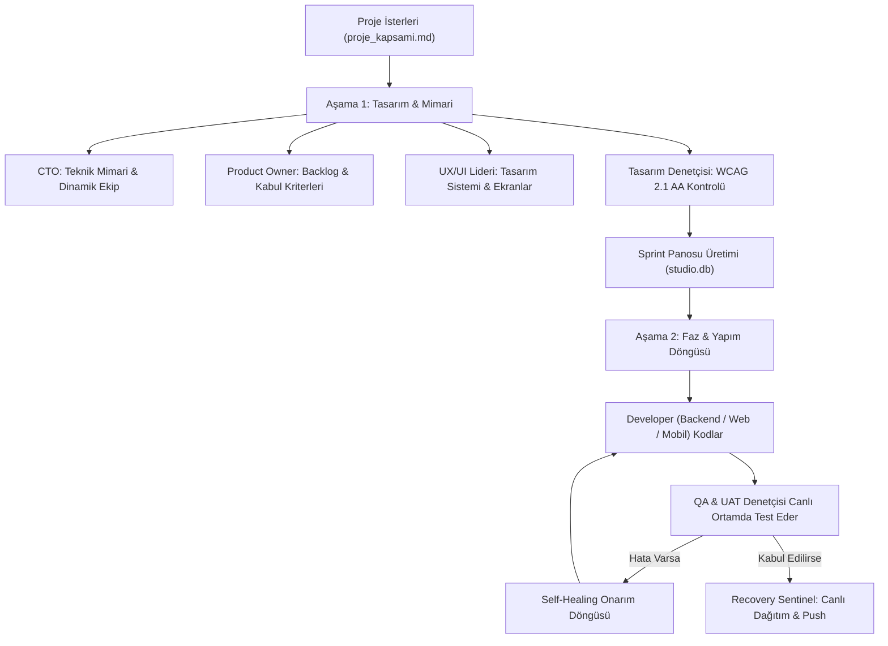

# 🤖 Digital Software Studio (Dijital Yazılım Stüdyosu)

> **Otonom Çok Ajanlı Yapay Zeka Yazılım Mühendisliği ve Üretim Stüdyosu**  
> *Autonomous Multi-Agent AI Software Engineering & Production Framework*

[](https://opensource.org/licenses/MIT)
[](https://python.org)
[](#)

Digital Software Studio, tek bir proje ister dokümanından (`proje_kapsami.md`) yola çıkarak; **CTO, Ürün Sahibi, UX/UI Tasarımcıları, Backend & Web & Mobil Geliştiricileri, QA Testçileri, UAT Denetçileri, DevOps ve Kurtarma Nöbetçisi** olmak üzere 15 farklı uzman yapay zeka ajanını organize eden, yazılımı uçtan uca mimarilendiren, kodlayan, canlı test eden ve yayına alan **tam otonom bir sanal yazılım şirketidir.**

---

## 🚀 2 Dakikada Hızlı Başlangıç (Quickstart)

Projeyi klonlayıp kendi yazılımınızı geliştirmeye başlamak için sadece 3 adım yeterlidir:

```bash
# 1. Depoyu klonlayın
git clone https://github.com/cihan53/digital-software-studio.git
cd digital-software-studio

# 2. Kurulum sihirbazını çalıştırın (venv ve önkoşulları hazırlar)
./setup.sh

# 3. Kendi proje fikrinizi yazın ve stüdyoyu başlatın!
nano proje_kapsami.md   # İstediğiniz uygulamanın özelliklerini yazın
./basla.sh              # Stüdyo çalışmaya başlar!
```

---

## 🧠 Nasıl Çalışır? (Mimari İş Akışı)

Digital Software Studio, geleneksel körü körüne kod yazan araçların aksine kurumsal yazılım yaşam döngüsünü (SDLC) harfiyen uygular:


```mermaid
flowchart TD
    A["Proje İsterleri (proje_kapsami.md)"] --> B["Aşama 1: Tasarım & Mimari"]
    B --> C["CTO: Teknik Mimari & Dinamik Ekip"]
    B --> D["Product Owner: Backlog & Kabul Kriterleri"]
    B --> E["UX/UI Lideri: Tasarım Sistemi & Ekranlar"]
    B --> F["Tasarım Denetçisi: WCAG 2.1 AA Kontrolü"]
    
    F --> G["Sprint Panosu Üretimi (studio.db)"]
    G --> H["Aşama 2: Faz & Yapım Döngüsü"]
    
    H --> I["Developer (Backend / Web / Mobil) Kodlar"]
    I --> J["QA & UAT Denetçisi Canlı Ortamda Test Eder"]
    J -->|"Hata Varsa"| K["Self-Healing Onarım Döngüsü"]
    K --> I
    J -->|"Kabul Edilirse"| L["Recovery Sentinel: Canlı Dağıtım & Push"]
```

---

## 👥 15 Uzman Yapay Zeka Ajanı (Organizasyon Şeması)

Stüdyo içerisinde her ajan yalnızca kendi uzmanlık alanına odaklanır:

| Rol | Unvan | Görevi |
| :--- | :--- | :--- |
| **`cto`** | CTO / Baş Mimar | Teknik vizyon, stack kararları, dinamik ekip ölçekleme. |
| **`product_owner`** | Ürün Sahibi | Kapsamı backlog'a çevirir, her ekrana kabul kriteri yazar. |
| **`ux_lead`** | UX Tasarım Lideri | Adım adım kullanıcı akışları, ekran envanteri, gezinme yapısı. |
| **`ui_designer`** | UI Tasarım Lideri | WCAG kontrast oranlı renk paleti, tipografi, HTML önizleme. |
| **`design_critic`** | Tasarım Denetçisi | Tasarımı acımasızca denetler (Approved / Changes Required). |
| **`tech_scout`** | Paket Araştırmacısı | "Tekerleği yeniden icat etme" ilkesiyle en iyi açık kaynak kütüphaneleri seçer. |
| **`security_lead`** | Güvenlik Mimarı | OWASP Top 10, RFC 7807, güvenli veri akışı mimarisi. |
| **`backend_engineer`** | Backend Geliştirici | REST/GraphQL API, veritabanı şemaları, migration ve servisler. |
| **`web_engineer`** | Web Geliştirici | Nuxt/Vue/React, SEO dostu sayfalar, durum yönetimi ve arayüzler. |
| **`mobile_engineer`** | Mobil Geliştirici | Flutter iOS & Android mobil uygulama geliştirimi. |
| **`qa_lead`** | QA / Test Lideri | Kabul kriterlerine karşı sınır testleri (Boundary Testing). |
| **`uat_auditor`** | UAT Denetçisi | Canlı sistemde gerçek tıklamalarla kullanıcı kabul testi. |
| **`screen_visitor_tester`** | Ziyaretçi Testçisi | 0 Console Errors ve 100% link/etkileşim denetimi. |
| **`devops_engineer`** | DevOps & Altyapı | Docker konteynerleri, CI/CD hatları, tek tıkla dev sunucusu. |
| **`recovery_sentinel`** | Süreç & Kurtarma Nöbetçisi | Çöken görevleri kurtarır, yarım kalan deploy'ları otonom yayınlar. |

---

## ⚖️ Müşteri Masası, Triage & Fazlama (`./musteri.sh`)

Müşteri veya ürün denetçisi olarak çalışan sistemi incelerken yeni bir hata veya istek bildirebilirsiniz:

```bash
./musteri.sh                        # İnteraktif müşteri menüsünü açar
./musteri.sh --hata "Başlık" "Detay"  # Anında HATA kaydı açar (Mevcut sprint hotfix hattına girer)
./musteri.sh --istek "Başlık" "Detay" # YENİ ÖZELLİK kaydı açar (Faz 2/3 havuzuna alınır)
./musteri.sh --triage               # Karar Verici Masası: Özellikleri fazlara atar
./musteri.sh --liste                # Tüm talepleri ve durumlarını listeler
```

### 🎯 Bug vs. Feature Ayrımı (Scope Creep Koruması)
- **`HATA` (Bug):** Mevcut stabilizasyonu bozduğu için derhal mevcut aktif sprinte alınır ve çözülür.
- **`ISTEK` (Feature):** Mevcut sprinti bölmemesi için `DEGERLENDIRMEDE` durumuna alınır; CTO & PO efor/maliyet analizi yaptıktan sonra ilgili faza (`FAZ-2`, `FAZ-3`) aktarılır.

---

## 🌐 Web Arayüzü (`./basla.sh --web`)

Tarayıcıdan erişilen sıfır-bağımlılık web arayüzü (saf Python `http.server`;
Windows/Linux/macOS ve IoT dahil tarayıcısı olan her cihazda çalışır):

```bash
./basla.sh --web                # http://127.0.0.1:8090
STUDIO_WEB_HOST=0.0.0.0 ./basla.sh --web   # LAN/IoT erişimine aç
```

| Ekran | İçerik |
| :--- | :--- |
| **`/`** | Karşılama: sistem durumu + iki kapı (Panel / Müşteri Odası) |
| **`/panel`** | Canlı sprint panosu, görev kontrolleri (duraklat/durdur/atla/geç/tekrar/kota onayı), öncelik **önerisi** için sürükle-bırak, Audit Log, İşlem Logları (her AI çağrısının rol/model/süre/maliyet/prompt-yanıt kaydı), Talepler, canlı çıktı akışı |
| **`/musteri`** | Müşteri sohbet odası: müşteri temsilcisi ajanı diyalogla talebi netleştirir, taslak çıkarır; müşteri onaylayınca talep havuzuna düşer ve mevcut triage/planlama zinciri işler |

Notlar:
- Görev **sıralaması** dışarıdan doğrudan değiştirilemez; sürükle-bırak yalnızca
  `oncelik` önerisi yazar. Son sırayı framework bağımlılık + faz + sprint
  kurallarıyla belirler.
- Tüm kontrol komutları `workspace/.control/` bayrak mekanizması üzerinden
  gider — motor iki çağrı arasında uygular; `force` çağrıyı anında keser.
- Müşteri talepleri artık yalnızca `studio.db`'de yaşar
  (`musteri_talepleri.json` üretilmez; `musteri_talepleri.md` insan-okur
  export olarak kalır).
- Sohbet ajanı `STUDIO_SOHBET_AGENT=0` ile kapatılabilir (mesaj doğrudan
  taslak talebe çevrilir, LLM çağrısı yapılmaz).

## 🖥️ Terminal TUI Kontrol Masası (`./basla.sh --izle`)

Stüdyo çalışırken terminal üzerinden canlı olarak izlenebilir:
- Anlık yürütülen görev ve sorumlu rol
- Günlük görev ve bütçe/harcama sayacı
- Sprint ilerleme yüzdesi ve tamamlanan dosyalar
- Görevi duraklatma (`s`) veya devam ettirme

---

## 🛠️ Komutlar Özeti (Cheatsheet)

| Komut | Açıklama |
| :--- | :--- |
| **`./basla.sh`** | Stüdyoyu arka planda başlatır ve kontrol ekranını açar. |
| **`./basla.sh --web`** | Web arayüzünü başlatır (panel + müşteri odası, :8090). |
| **`./basla.sh --izle`** | Canlı TUI kontrol ekranını açar. |
| **`./basla.sh --durum`** | Tek satırlık durum ve kota özeti basar. |
| **`./basla.sh --kurtar`** | Kurtarma ajanını çalıştırır, yarım kalan işleri ve deployları tamamlar. |
| **`./basla.sh --onayla`** | Günlük kota dolduğunda ek görev izni verir. |
| **`./basla.sh --tara <dizin>`** | Var olan bir projeyi deterministik tarar; sonucu `workspace/docs/kaynak_proje_*.md` olarak yazar (analiz/migrasyon işlerinde). |
| **`./basla.sh --durdur`** | Çalışan stüdyoyu nazikçe durdurur. |
| **`./basla.sh --oncelik <görev> <n>`** | Görev önceliğini değiştirir (büyük = önce koşar). |
| **`./basla.sh --sira <görev> <poz>`** | Görevi sprint içinde yeniden sıralar. |
| **`./basla.sh --sprint-sira <sprint> <poz>`** | Sprint sırasını değiştirir. |
| **`./basla.sh --gec <görev> [--force]`** | Başka bir göreve geçer; `--force` çağrıyı anında keser. |
| **`./basla.sh --atla [<görev>] [--force]`** | Görevi atlar (id yoksa koşan/sıradaki). |
| **`./musteri.sh`** | Müşteri denetim masasını açar. |

---

## 🔎 Mevcut Projeyi Stüdyoya Tanıtma (Kaynak Taraması)

Sıfırdan ürün yerine **var olan bir kod tabanını** analiz ettirmek/migre ettirmek
istiyorsanız (ör. Angular → Vue çevirisi), önce kaynak projeyi deterministik
olarak taratın:

```bash
./basla.sh --tara /path/to/kaynak-proje
# eşdeğer: python3 scripts/kaynak_tarama.py --kaynak /path/to/kaynak-proje
```

Tarayıcı LLM **kullanmaz** — dosya sistemi ve desen eşleştirme ile çalışır ve
`workspace/docs/` altına üç parça yazar (her biri girdi boyut sınırının altında):

| Dosya | İçerik |
| :--- | :--- |
| `kaynak_proje_taramasi.md` | Teknoloji yığını, rol/menü enum'ları, guard'lar, erişim servisleri, **tüm routing dosyalarının tam kaynağı** |
| `kaynak_proje_yetki_taramasi.md` | `ngxPermissionsOnly/Except` kullanımları, `.ts` içi rol/feature kontrolleri, koşullu görünürlük satırları |
| `kaynak_proje_envanter.md` | Modül/dizin/component/servis envanteri |

Motor, `workspace/docs/kaynak_proje_*.md` dosyalarını gördüğünde bunları
**design aşamasındaki tüm rollerin girdisine otomatik ekler** ve prompt'a
"tarama otoritedir" notu düşer — böylece CTO/PO/UX/güvenlik analizleri
uydurma değil, kaynak kodun gerçek route–guard–rol–feature envanteri üzerinden
yapılır.

> Yeniden analiz için: çıktıları state'ten sıfırlayıp motoru
> `studio_engine.py --full --yes --replan` ile çalıştırın.

### Analiz derinliği: kelime bütçesi çarpanı

Kapsamlı analizlerde rol dokümanlarının kelime bütçesini ölçekleyin:

```bash
python3 studio_engine.py --full --yes --word-scale 3   # veya
STUDIO_WORD_SCALE=3 ./basla.sh
```

`--word-scale N` her rolün `max_words` bütçesini N ile çarpar (ör. UX Lideri
2400 → 7200 kelime). Varsayılan `1`'dir.

---

## 🧩 Model Arka Ucu (Backend) Seçimi — `agy` veya `devin`

Stüdyo, ajan çağrılarını iki farklı motor üzerinden yürütebilir:

| Backend | Motor | Nasıl seçilir? |
| :--- | :--- | :--- |
| **`agy`** *(varsayılan)* | Antigravity CLI / Gemini | Ek ayar gerekmez |
| **`devin`** | Devin AI (yerel `devin` CLI veya Devin Cloud) | `STUDIO_BACKEND=devin` |

```bash
# Tüm stüdyoyu Devin AI ile çalıştır
STUDIO_BACKEND=devin ./basla.sh

# Devin Cloud VM'lerinde çalıştır (Devin hesabı gerekir)
STUDIO_BACKEND=devin STUDIO_DEVIN_CLOUD=1 ./basla.sh

# Belirli bir Devin modeli seç (ör. swe-2, opus, codex; boş = hesap varsayılanı)
STUDIO_BACKEND=devin STUDIO_DEVIN_MODEL=swe-2 ./basla.sh
```

**İleri düzey:** `org_chart.json` içinde tek bir role `"backend": "devin"` yazarak
(ve isteğe bağlı `"devin_model": "..."`) karma mimari kurabilirsiniz; diğer
roller varsayılan backend ile çalışmaya devam eder.

İlgili çevre değişkenleri: `STUDIO_BACKEND`, `STUDIO_DEVIN_MODEL`,
`STUDIO_DEVIN_CLOUD`, `STUDIO_DEVIN_TIMEOUT`, `STUDIO_DEVIN_PERMISSION_MODE`
(bkz. `.env.example`).

### Asılı Kalma Gözcüsü (otomatik kurtarma)

Bir CLI çağrısı (agy / devin / claude) uzun süre **hiçbir canlılık sinyali**
üretmeden beklemede kalırsa — CPU ilerlemesi yok, stdout'da bayt yok ve
süreç grubunda açık `ESTABLISHED` TCP soketi yok — motor süreç grubunu kendi
kendine keser ve çağrıyı yeniden dener. Böylece API isteği ölü kalıp CLI
sonsuz beklediğinde manuel `kill` + pipeline yeniden başlatma gerekmez.

- `STUDIO_CLI_STALL` (vars. **600s**): inaktivite eşiği; `0` kapatır.
- `STUDIO_CALL_RETRY` (vars. **2**): asılı kalma başına en fazla yeniden
  deneme. Tükenirse panelde alternatif motor önerisi çıkar ve hata
  çağırana iletilir — kısır döngüye girilmez.
- `STUDIO_DEVIN_STALL` (vars. **300s**): devin'e özel ek koruma — model
  yanıtı `stop` ile bitirmiş ama CLI çıkmıyorsa, tamamlanmış son mesaj
  `sessions.db`'den kurtarılıp çağrı başarılı sayılır.

---

## 🛡️ Güvenlik & Gizlilik (Zero Leakage Protocol)

Digital Software Studio, açık kaynak güvenliğine tam uyumludur:
- Asla sabit API anahtarı, şifre veya gizli token barındırmaz.
- Tüm kimlik doğrulamalarını yerel çevre değişkenleri veya `agy` CLI üzerinden yürütür.
- Üretilen tüm proje kodları yalıtılmış `workspace/` dizininde tutulur ve `.gitignore` ile korunur.

---

## 📄 Lisans

Bu proje [MIT Lisansı](LICENSE) ile lisanslanmıştır. Dünyadaki herkes dilediği gibi kullanabilir, değiştirebilir ve kendi otonom yazılımlarını üretebilir.

## Sınırlı analiz ve korumalı keşif (`workspace/studio.config.json`)

Projeye özel değerler (kaynak, birim türü, keşif sözleşmesi) framework dosyalarında değil
`workspace/studio.config.json` içinde tutulur (örnek: `scripts/studio.config.example.json`).
Dosya yoksa eski davranış sürer.

- **Bütçeli analiz:** birim başına ayrı dosya, sabit şablon, kelime tavanı, L1/L2 derinlik ve L2 kotası,
  kanıt (`[kaynak: ...]`) zorunluluğu. Doğrulama: `python3 scripts/analiz_dogrula.py`.
- **Korumalı keşif:** `discovery_analyst` rolü yalnızca geçerli keşif sözleşmesiyle çalışır
  (`--only discovery_analyst`); kuyruk envanterden gelir, `read_only` mod, ziyaret günlüğü.
  Sapma denetimi: `python3 scripts/kesif_denetle.py`.

### Melez keşif gezgini (LLM'siz)

Tarayıcı kısmı koddur, yazım kısmı deterministik; model çağrısı gerekmez:

```bash
node scripts/kesif_gezgin.mjs --login   # görünür Chrome: BİR KEZ giriş yap (şifre betiğe girmez, profil workspace/.kesif_profil)
node scripts/kesif_gezgin.mjs           # envanteri gez; devam edilebilir (--fresh, --only '^/admin', --headed)
python3 scripts/kesif_yaz.py            # ham bulgu → şablonlu birim dosyaları
python3 scripts/analiz_dogrula.py && python3 scripts/kesif_denetle.py
```

Gezgin her ziyareti/tıklamayı `kesif_denetle.py --sunucu` ile sözleşmeye karşı denetler; yalnızca görünür ve
dialog dışındaki `discovery.open_labels` butonlarına tıklar, `deny.labels` (save, delete, merge, export …) asla.
Sayfa seçicileri `discovery.selectors` ile projeye göre ayarlanır. Gereksinim: Node 22 + sistemde Chrome (`CHROME_PATH`).

### İnsan onay kapısı ve API şema keşfi

- **`role: human` görevleri** koşucu tarafından asla çalıştırılmaz; bağımlılıkları bitince `READY`'de bekler.
  `python3 scripts/insan_onayi.py list | approve <ID> --not "..." | reject <ID> --not "..."` ile bir insan onaylar;
  onay kaydı (kim/ne zaman/not) görevin `.md` çıktısına yazılır ve audit'e düşer.
- **`node scripts/kesif_gezgin.mjs --fresh --sema`**: GET JSON yanıtlarının alan adı/tipini `<output_dir>/_api_semalari.json`
  olarak toplar. Değer saklanmaz (yalnız `status/type/severity…` gibi sözlük alanlarında en çok 12 kısa enum değeri).
- Pano kapanış raporu artık sabit "ONAYLANDI" şablonu değil, görev durumundan üretilen bir durum raporudur.

### Canlı sistem portları (`live.ports`)

`workspace/studio.config.json → "live": {"ports": [3000, 8080]}` UAT/ziyaretçi görevlerinin "sistem ayakta mı" kontrolünde
baktığı portları belirler (varsayılan 3000, 3001). Proje farkı artık `studio_board.py`'de değil config'te; dosya özelleştirilmez.

### Yetenek katmanı (studio kendi ihtiyacını analiz edip araç yazabilir)

- `discovery_analyst` rolü kod okuyup yazabilir (Edit/Write + node/python3/git): eksik bir keşif yeteneğini (ör. sekme/form/çekmece okuma)
  mevcut gezgine ekler, test eder, çalıştırır. Önce `python3 scripts/yetenek_kontrol.py --ihtiyac node22,chrome,kesif-profili` ile ortamı ölçer.
- İndirme/kurulum, giriş (kimlik doğrulama) ve onay gerektiren eksikleri kendisi yapmaz: komutunu `workspace/docs/yetenek_raporu.md`'ye yazar, insan adımı olarak bırakır.
- `python3 scripts/koruma_kontrol.py`: izin sözleşmesi dosyaları (`kesif_denetle.py`, `studio_config.py`, `insan_onayi.py`) görev tarafından değiştirildiyse hata verir.

### Servisler: panel, yerel ortam, çıkış

- `./basla.sh` koşucuyla birlikte web panelini de açar (pid: `workspace/.web.pid`).
- Kontrol ekranında `q` bir çıkış menüsü açar: **e** yalnız ekranı kapat · **p** panel + yerel ortam servislerini de kapat (koşu sürer) · **h** koşuyu da durdur, her şeyi kapat.
  `STUDIO_CIKIS=ekran|servisler|hepsi|sor` menüyü atlatır (varsayılan `sor`).
- `./basla.sh --servisler` listeler, `--servisler-kapat` panel+ortamı, `--kapat` koşu dahil hepsini kapatır.
  Yalnızca çalışma dizini bu projenin altındaki süreçler (ve `live.ports` dinleyicileri) kapatılır; başka projelere dokunulmaz.

### Yalıtım: projeye özel her şey `workspace/` altında

Kök yalnızca framework dosyalarını taşır; `./sync_studio.sh --studio-guncelle` bunları AYNEN yazar. Projeye özel dosyalar:

| Dosya | Yer |
|---|---|
| Proje kapsamı / org şeması | `workspace/docs/proje_kapsami.md`, `workspace/docs/org_chart.json` (kökte olanlar geriye uyumlu okunur) |
| Yapılandırma | `workspace/studio.config.json` (kaynak, analiz/keşif sözleşmesi, `live.ports`) |
| Betik override'ı | `workspace/scripts/<ad>`: aynı adlı framework betiğinin yerine geçer (örn. `uat_live_audit.mjs`, `tarayici_test_izle.mjs`); yoksa `scripts/<ad>` |
| Projeye ait betikler | `workspace/scripts/` |

`protected_files` mekanizması bu sayede gereksizleşir; override'lar güncellemeden etkilenmez.

### Panel: insan onayları

Panelde **✅ Onaylar** sekmesi bekleyen insan kapılarını listeler (sekme rozeti = bekleyen sayısı). Her kapıda bağımlı görevlerin
çıktıları (ör. tasarım dokümanı) panelden okunur; not yazıp **Onayla** / **Reddet** (ret için gerekçe zorunlu). Karar onay kaydına
(kim/ne zaman/not) yazılır ve audit'e düşer; onaylanan kapının bağlı görevlerini koşucu kendiliğinden başlatır. Yazma isteği yalnız aynı kaynaktan
ve JSON gövdeyle kabul edilir; panel varsayılan olarak yalnız 127.0.0.1'e bağlıdır.

### Depo hijyeni

`python3 scripts/depo_hijyeni.py` (rapor) / `--uygula`: yalıtım modeline uygun yönetilen `.gitignore` ve `.gitattributes` blokları
(db, loglar, ham keşif verisi, görseller, trace ayrıntısı, framework dosyaları git dışı; `workspace/` altındaki proje dosyaları içeride) ve izlenen artıkların
`git rm --cached` ile temizliği. `setup.sh` bunu otomatik çalıştırır. Otomatik commit öncesi `workspace/pano_snapshot.json` yenilenir (`studio.db` git dışı olduğu için).

### Birim-envanteri tabanlı plan üretici

`studio.config.json → planlama.uretici = "birim"` iken `--replan`, LLM planlayıcı yerine keşif envanterinden deterministik pano üretir
(`python3 scripts/birim_envanteri.py` sonra `python3 scripts/plan_birim.py --dry-run | --yaz`). Modül başına tasarım → **insan kapısı** → mock → ekran → parite;
`Girdi:`/`İncele:` satırları, isteğe bağlı HTML önizleme, genel kabuk ve son kabul sprint'i. Ayarlar: `planlama {parca, html_onizleme, insan_kapisi, atla_modulleri, sprint_birim, sprintler, kurallar, roller, dizinler}`.

### Brief görüşmesi (panel: 💬 Brief Görüşmesi)

Kısa, insani bir `proje_kapsami.md` yazın; **müşteri temsilcisi, ürün sahibi ve CTO** sırayla TEK soru sorar, siz kendi sözlerinizle cevaplarsınız.
Cevaplar rol etiketiyle (`<!-- rol: ... -->`) brief'in "Görüşmeden eklenenler" bölümüne **sizin sözlerinizle** işlenir; rol yalnız konu başlığı ve kısa bir not ekler, yeni olgu uydurmaz.
Durum `workspace/docs/brief_gorusme.json`'dadır; LLM yoksa yedek sorular kullanılır.

### Deney kolları (`scripts/deney_kur.py`)

Aynı girdi paketiyle (brief, org_chart, keşif/ekran analizleri, planlama ayarı) birden çok yalıtılmış proje klasörü kurar; farklı olan yalnız backend/model/porttur (claude / gemini=agy / devin).
Her kolda framework `git clone` edilir (`origin` → `framework`, push kapalı), `workspace/calistir.sh` hazırlanır, **servis başlatılmaz**.

```bash
python3 scripts/deney_kur.py kur --kaynak <proje> --hedef <ana dizin> --onek <ad> --brief <brief.md> [--github-sahip <kullanıcı>] [--plan]
python3 scripts/deney_kur.py esitle (--kaynak-kol <dizin> | --kaynak-dosya <brief.md>) --hedefler <dizin>,<dizin>   # yalnız proje_kapsami.md taşınır; başlamış kola dokunmaz
```

### Dokümanlar sekmesi (panel: 📚 Dokümanlar)

`workspace/docs` altındaki üretilmiş analiz, tasarım ve ekran dokümanlarını panelde gezilebilir ağaç + markdown görüntüleyici ile okursunuz (salt-okuma).
Ekran dokümanlarının üstünde referans ekran görüntüsü (`_gorsel/<ad>.png`) gösterilir; markdown içindeki resimler ve dokümanlar arası bağlantılar çalışır, `.html` dokümanlar korumalı iframe'de açılır.
Yalnız `workspace/` altı okunur; `_ham/` (yerel, PII içerebilir) ve `.svg` (betik taşıyabilir) listelenmez.

### Yerel Ortam sekmesi (panel: 🖥 Yerel Ortam)

`workspace/yerel_ortam.sh` (S1-T1 görevi üretir) oluşunca panelden **Başlat / Yeniden başlat / Durdur** ve canlı log izleme: portların durumu (`live.ports`), log `workspace/logs/yerel_ortam.log`.
Yalnız projenin kendi betiği çalıştırılır; kapatma yalnız bu projeye ait süreçlere dokunur. Yazma uçları aynı-kaynak korumalıdır.

### Uygulama dizini sözleşmesi

Devops, web ve test görevleri aynı uygulama dizinini kullanır: `planlama.dizinler.uygulama` (varsayılan `workspace/src/web`). Planlayıcı istemine eklenir; üretilen panodaki ilgili görevlerin açıklamasına ve eş-anlamlı çıktı yollarına (`frontend`, `app`, `client`, `ui`) uygulanır. `yerel_ortam.sh` üreten göreve "dizini sabit yazma, `nuxt.config.*`/`package.json` bulunan dizini keşfet" kuralı eklenir. (`scripts/uygulama_dizini.py`)

### Kalite denetimi ayarları (`studio.config.json` → `kalite`)

Çerçeve hiçbir projeye özel kural taşımaz. İsteğe bağlı: `kalite.kritik_rotalar` (`[{"ad": "...", "isaretler": ["userRoutes", "/users"]}]`; backend `app.ts`te korunması gereken rotalar) ve `kalite.nuxt_host_kontrolu` (`nuxt.config.*` içinde `devServer`/`127.0.0.1` zorunlu). Varsayılan: ikisi de kapalı. Sprint rehberi `live.ports` ve `workspace/yerel_ortam.sh`ten üretilir.

### Çerçeve projeden bağımsızdır

Çerçeve dosyaları (motor, betikler, şablon roller, panel) hiçbir projeye özel yol, alan, teknoloji ya da rota içermez; `tests/test_cerceve_genel.py` bunu denetler. Projeye özel her şey `workspace/` altındadır: `studio.config.json` (`live.ports`, `planlama.dizinler.*`, `kalite.*`), `workspace/uat_checklist.json` (genel UAT/ziyaretçi betikleri için rota ve kontrol listesi) ve `workspace/scripts/<ad>` (aynı adlı çerçeve betiğinin yerine geçen proje betikleri).

Dokümanlar sekmesinde `.html` dokümanlar (tasarım önizlemesi vb.) **yeni sekmede** açılır: `/api/dokuman-html` yalnız `workspace/` altı `.html` sunar; `Content-Security-Policy: sandbox` ile opak origin'de çalışır (panel API'sine erişemez, ağ yok). Onaylar sekmesindeki önizlemede de "↗ Yeni sekmede aç" bağlantısı vardır.

Günlük kota/bütçe dolunca koşucu **çıkmaz**: `[⏸ KOTA ONAYI BEKLENİYOR]` ile bekler, panelden ya da `./basla.sh --onayla` ile onay gelince (veya gece sıfırlanınca) kaldığı yerden devam eder. Durdurma isteği çıkarır; azami bekleme `STUDIO_KOTA_BEKLEME_SN` (varsayılan 6 saat).

### Render kapısı ve Önizleme

**Render kapısı** (`scripts/render_kapisi.mjs`, bağımlılıksız; headless Chrome'u CDP ile sürer): HTTP 200 sayfanın doğru çizildiği anlamına gelmez. Kapı her rotada konsol hatası / `[Vue warn]` / çözülemeyen bileşen / hydration uyuşmazlığı / 5xx / boş sayfa ve eksik çatı (header, nav, main) arar; ekran görüntüleri `workspace/docs/ekran_goruntuleri/`, rapor `workspace/docs/render_raporu.md`. UAT ve ziyaretçi-test görevlerinde otomatik koşar; başarısızlık mevcut talep/telafi akışına girer. Chrome ya da canlı sistem yoksa atlanır (çıkış 3, `CHROME_PATH` ile yol verilebilir).
Ayar `workspace/uat_checklist.json` (hepsi isteğe bağlı): `rotalar` (yoksa uygulama dizinindeki `pages/` dosyalarından türetilir), `giris` (`rota`, `doldur`: {seçici: değer}, `tikla`; test/mock hesabı), `cati` (`secici`, `haric`), `yoksay`.

**Önizleme** (panel: 🌐 Önizleme): üretim derlemesini (`build` + `preview`, `onizleme.port` ya da dev portun +1'i; `workspace/onizleme.sh` ile özelleştirilebilir) başlatır. Geliştirme sunucusu (`🖥 Yerel Ortam`) ajanlara, önizleme müşteriye gösterilir; Docker yalnız sürüm çıktısıdır, günlük çalışmada gerekmez.
